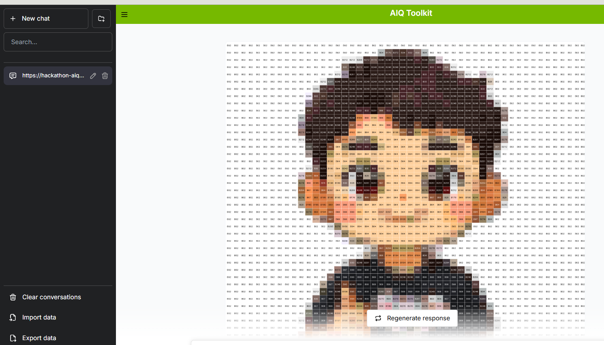

# BeanBuddy-AI




## 🎯 项目简介
> **BeanBuddy-AI** 是一个基于多智能体协作的多模态Q版拼豆设计系统。  
> 基于[NAT框架](https://github.com/NVIDIA/NeMo-Agent-Toolkit/tree/develop)构建，该系统通过集成视觉理解、风格转换、图案生成和材料规划等多个智能体模块，允许用户通过文本、草图或图片输入来自动生成可爱的Q版拼豆设计方案。项目采用MCP协议实现智能体间通信与任务协调，并结合生成式AI技术提供创意支持与可视化输出，致力于降低拼豆创作门槛并激发用户的创造力 。

### ✨ 核心特性

- 🤖 **官方架构**: 100%使用NVIDIA官方NeMo Agent Toolkit
- 🔧 **灵活配置**: 支持任何OpenAI兼容的API接口
- 🎨 **现代界面**: 官方UI，支持实时对话和流式响应
- 🚀 **一键部署**: 支持Windows/Linux/macOS

## 🏗️ 技术架构

### 前端
- **框架**: Next.js 14 + TypeScript
- **UI库**: 官方[NeMo-Agent-Toolkit-UI](https://github.com/NVIDIA/NeMo-Agent-Toolkit-UI)
- **特性**: 实时聊天、主题切换、历史记录

### 后端
- **核心**: [NVIDIA NeMo Agent Toolkit (AIQ)](https://github.com/NVIDIA/NeMo-Agent-Toolkit/tree/develop)
- **工作流**: React Agent
- **工具**: 描述增强工具、知识图谱查询工具、主体提取工具、文生图工具、图片转拼豆设计图工具
    
### 模型支持
- **默认**: Qwen模型
- **兼容**: 任何OpenAI格式的API
- **自定义**: 用户可配置API密钥、模型名称、base_url

## 🚀 快速开始

### 📋 环境要求

- **Python**: 3.12+
- **Node.js**: 18+
- **Git**: 最新版本
- **操作系统**: Windows 10+/macOS 10.15+/Ubuntu 20.04+

### ⚡ 一键安装

#### 克隆项目
```shell
git clone https://git@github.com:ItGarbager/BeanBuddy-AI.git
cd BeanBuddy-AI
```

#### 安装依赖

##### 后端
```shell
cd backend/
pip install -r requirements.txt
pip install -e beanbuddy_ai
```

##### 前端
```shell
cd frontend
npm install # 也可以使用cnpm install加快下载
```

### 🔑 配置API密钥

安装完成后，您需要配置以下API密钥：

#### 1. 前端oss对象存储密钥
在`frontend/components/Chat/ChatInput.tsx`中，将 `accessKeySecret` 替换
```ts
new OSS({
    region: process.env.REACT_APP_OSS_REGION || 'oss-cn-beijing',
    accessKeyId: process.env.REACT_APP_OSS_ACCESS_KEY_ID || 'LTAI5tMdnfA1ZARnE1r8pVFf',
    accessKeySecret: process.env.REACT_APP_OSS_ACCESS_KEY_SECRET || 'oss对象存储密钥',
    bucket: process.env.REACT_APP_OSS_BUCKET || 'hackathon-aiqtoolkit',
    authorizationV4: true, // 浏览器端必须开启V4签名
    secure: true, // 用HTTPS（避免HTTP跨域问题）
});
```

#### 2. 大模型API密钥

编辑 `backend/beanbuddy_ai/src/beanbuddy_ai/configs/config.yml` 中,替换成你自己的Bailian API Key：

```yaml
llms:
  # 默认使用 BAILIAN API (用户可修改)
  default_llm:
    _type: openai
    model_name: "qwen-plus"
    api_key: "阿里云百炼平台的API-KEY"
    base_url: "https://dashscope.aliyuncs.com/compatible-mode/v1"
    temperature: 0.7
    max_tokens: 2048
```

**支持的API提供商**：
- **阿里云百炼平台Qwen系列**: `https://bailian.console.aliyun.com/?tab=model#/model-market`
- **其他**: 任何OpenAI兼容的API


### 🎮 启动系统

#### 启动后端服务
```shell
cd backend
nat serve --config_file beanbuddy_ai/src/beanbuddy_ai/configs/config.yml --host 0.0.0.0 --port 8001
```

#### 启动前端服务
```shell
cd frontend
npm run dev
```

### 🌐 访问地址

- **前端界面**: http://localhost:3000
- **API文档**: http://localhost:8001/docs
- **健康检查**: http://localhost:8001/health

## 🧪 功能测试

### 主体拼豆设计图生成
> - 用户: 佐助  
> - AI:  
> 


### 上次图片转拼豆设计图
> - 用户:  
> 

> - AI:   
> 


### 描述转拼豆设计图
> - 用户: 一只马三只脚腾空，一只脚踩在一个飞的燕子上  
> - AI:  
> 


## 📁 项目结构

```
nvidia-nemo-agent-toolkit-hackathon/
├── configs/                    # 配置文件
│   └── hackathon_config.yml   # 主配置文件
├── external/                   # 外部模块
│   └── aiqtoolkit-opensource-ui/  # 官方UI
├── docs/                       # 文档和截图
│   └── ui_screenshot.png      # 界面截图
├── src/                        # 源代码
├── install.sh                  # Linux/macOS安装脚本
├── install.bat                 # Windows安装脚本
├── start.sh                    # 启动脚本
├── stop.sh                     # 停止脚本
└── README.md                   # 说明文档
```

## ⚙️ 高级配置

### 自定义工具

在配置文件中添加新工具：

```yaml
functions:
  your_custom_tool:
    _type: your_tool_type
    description: "工具描述"
    # 其他配置参数
```

### 自定义工作流

```yaml
workflow:
  _type: react_agent
  tool_names:
    - internet_search
    - current_datetime
    - your_custom_tool
  llm_name: default_llm
  verbose: true
```

### 调试模式

```bash
# 启用详细日志
nat serve --config_file backend/beanbuddy_ai/src/beanbuddy_ai/configs/config.yml --host 0.0.0.0 --port 8001 --verbose
```

## 🐛 故障排除

### 常见问题

#### 1. 端口占用
```bash
# 检查端口占用
netstat -tlnp | grep :8001

# 使用不同端口
aiq serve --port 8002
```

#### 2. API密钥错误
- 检查 `backend/beanbuddy_ai/src/beanbuddy_ai/configs/config.yml` 中的API密钥配置
- 验证API密钥的有效性和权限


#### 4. 前端无法连接后端
- 检查后端是否正常启动（访问 http://localhost:8001/health）
- 确认端口配置正确
- 检查防火墙设置

### 日志查看

```bash
# 查看后端日志
tail -f logs/aiq.log

# 查看前端日志
cd external/aiqtoolkit-opensource-ui
npm run dev -- --verbose
```

## 📚 相关资源

### 官方文档
- [NVIDIA NeMo Agent Toolkit](https://github.com/NVIDIA/NeMo-Agent-Toolkit)
- [官方文档](https://docs.nvidia.com/nemo-agent-toolkit/)
- [NeMo Agent Toolkit UI](https://github.com/NVIDIA/NeMo-Agent-Toolkit-UI)

### API文档
- [Tavily API文档](https://docs.tavily.com/)
- [阿里云百炼平台](https://bailian.console.aliyun.com/?tab=doc#/doc)
- [OpenAI API文档](https://platform.openai.com/docs/)

### 学习资源
- [AI Agent开发指南](https://docs.nvidia.com/nemo-agent-toolkit/user-guide/)
- [React Agent工作流](https://docs.nvidia.com/nemo-agent-toolkit/workflows/react-agent/)
- [MCP协议文档](https://docs.nvidia.com/nemo-agent-toolkit/mcp/)

## 🏆 黑客松信息

本项目专为推广NVIDIA NeMo Agent Toolkit技术而开发，旨在：

- 🎯 **展示AI Agent能力**: 通过实际应用展示NVIDIA NeMo Agent Toolkit的强大功能
- 🚀 **降低学习门槛**: 提供完整的示例代码和详细文档，帮助开发者快速上手
- 🌟 **促进技术交流**: 为AI Agent技术爱好者提供学习和交流的平台
- 💡 **激发创新思维**: 鼓励开发者基于此项目创建更多创新应用

### 技术亮点

- ✅ **完全官方架构**: 严格遵循NVIDIA官方技术规范
- ✅ **生产级质量**: 包含完整的错误处理、日志记录和监控
- ✅ **易于扩展**: 模块化设计，支持快速添加新功能
- ✅ **跨平台支持**: 一套代码，多平台运行


---

**🎯 让我们一起探索AI Agent的无限可能！**

> 本项目展示了NVIDIA NeMo Agent Toolkit在实际应用中的强大能力，为AI Agent技术的普及和发展贡献力量。无论您是AI初学者还是资深开发者，都能从这个项目中获得有价值的学习体验。
